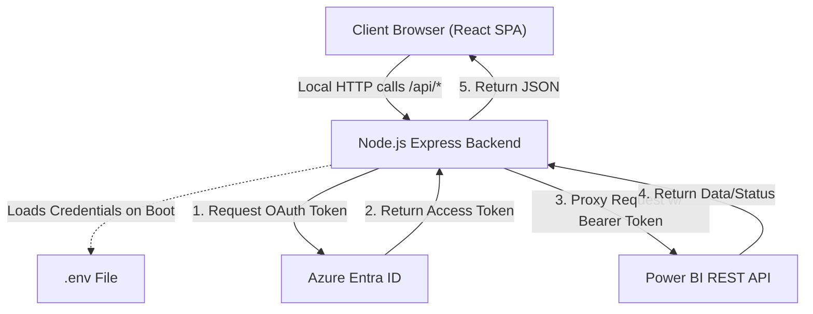
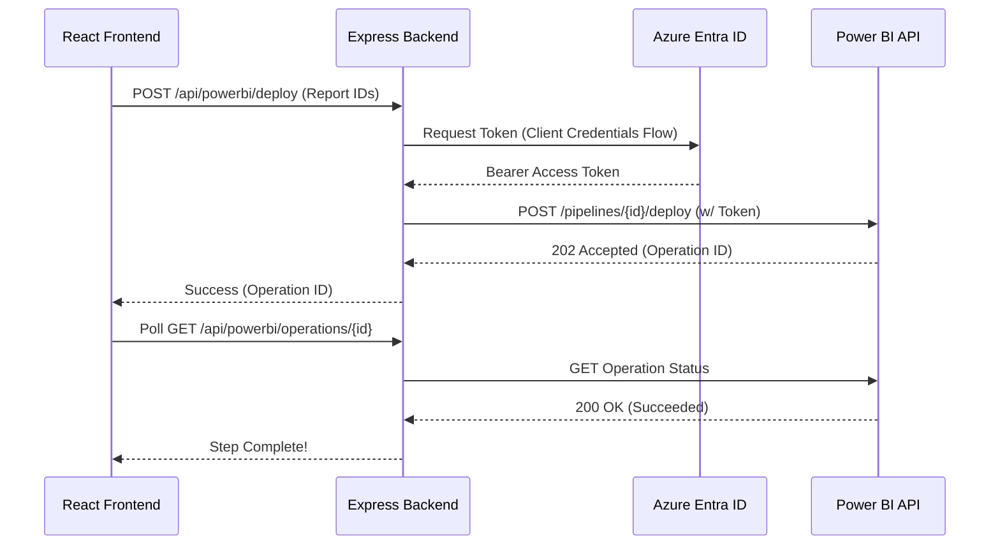

# Power BI Deployment Orchestrator

A full-stack web application designed to orchestrate and automate Microsoft Power BI deployment pipelines. Built with React (frontend) and Express (backend), this application securely manages Azure Entra ID Service Principal credentials to automate report deployments, dataset parameter updates, and semantic model refreshes.

## 🚀 Features

* **Pipeline Discovery:** Automatically fetches workspace bindings and artifact lists (reports, datasets) for a given Power BI Deployment Pipeline.
* **Stage-to-Stage Deployment:** Triggers the promotion of selected reports and datasets from a source stage (e.g., Test) to a target stage (e.g., Production).
* **Parameter Management:** Inspects dataset parameters post-deployment and allows you to dynamically update them (e.g., pointing a database connection from a test server to a production server).
* **Automated Refresh:** Triggers and polls cloud-side dataset refreshes to ensure data is populated after a deployment and parameter update.
* **Secure Architecture:** Eliminates client-side credential exposure. All OAuth token acquisition and Power BI REST API communications occur strictly on the backend Node.js (Express) server.
* **Execution Telemetry:** Built-in transaction logger to inspect request payloads, response codes, and durations.

## 🏗️ Architecture & How It Works

The application operates on a robust Full-Stack architecture to ensure security. 

* **Frontend (React + Vite + Tailwind):** Renders the multi-step deployment wizard and logs view. It communicates exclusively with the local backend.
* **Backend (Node.js + Express):** Acts as a secure proxy. It holds the Azure `client_secret` in memory, acquires temporary OAuth tokens from Azure Entra ID, and forwards requests to the Power BI REST API.

### Architecture Diagram



### Sequence Flow (Example: Triggering a Deployment)



## 📋 Prerequisites

Before running this application, you must configure the following in your Microsoft/Azure environment:

1. **Azure Entra ID App Registration (Service Principal):**
   * Create an App Registration in your Azure Portal.
   * Generate a Client Secret.
   * Add Power BI Service API permissions (e.g., `Pipeline.ReadWrite.All`, `Dataset.ReadWrite.All`, `Workspace.ReadWrite.All`).
   * **Important:** Grant Admin Consent for these permissions in your tenant.
2. **Power BI Admin Settings:** Ensure "Allow service principals to use Power BI APIs" is enabled in the Power BI Admin Portal.
3. **Workspace Access:** Add the Service Principal as an "Admin" or "Member" to the workspaces bound to your deployment pipeline.
4. **Node.js:** Ensure you have Node 18 or higher installed locally.

## ⚙️ Installation & Setup

1. **Install Dependencies:**
   ```bash
   npm install
   ```

2. **Configure Environment Variables:**
   Create a `.env` file in the root directory (you can copy `.env.example`).
   ```env
   AZURE_TENANT_ID="your_tenant_id_here"
   AZURE_CLIENT_ID="your_client_id_here"
   AZURE_CLIENT_SECRET="your_client_secret_here"
   
   # For a single pipeline:
   POWERBI_PIPELINE_IDS="your_pipeline_id_here"
   
   # For multiple pipelines (comma-separated):
   POWERBI_PIPELINE_IDS="pipeline_1_id,pipeline_2_id,pipeline_3_id"
   ```
   *Note: If you provide multiple pipeline IDs, the application will display a dropdown selector in the header, allowing you to seamlessly switch between orchestration pipelines.*

3. **Start the Development Server:**
   ```bash
   npm run dev
   ```
   The application will be available at `http://localhost:3000`.

## 📦 Deployment for Production

Because this application uses a custom Express server (`server.ts`) to handle API proxying and Vite middleware, it is best suited for Node.js hosting environments like **Render**, **Railway**, **Heroku**, or **Google Cloud Run**.

It is *not* currently designed for serverless environments like Vercel out-of-the-box, as Vercel expects serverless functions rather than a long-running Express app.

**Production Build Steps:**
```bash
# 1. Build the React SPA and bundle the Express server
npm run build

# 2. Start the compiled production server
npm start
```
When deploying to a cloud host, simply ensure your `AZURE_TENANT_ID`, `AZURE_CLIENT_ID`, `AZURE_CLIENT_SECRET`, and `POWERBI_PIPELINE_ID` are set as Environment Variables in your hosting provider's dashboard.

## 🔒 Security Posture

* **No UI Input:** The app intentionally lacks a UI for entering Azure secrets. This prevents exposure on public-facing URLs.
* **In-Memory Token Handling:** Access tokens are stored ephemerally in the backend node process.
* **Server-Side API Proxy:** The React frontend never talks to Microsoft APIs directly. It only knows about the local `/api/` endpoints, guaranteeing that Client Secrets never touch the user's browser or network payload.
