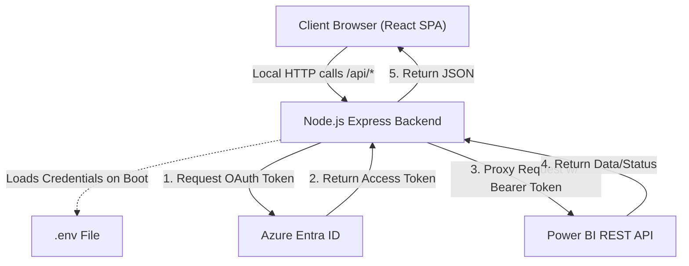
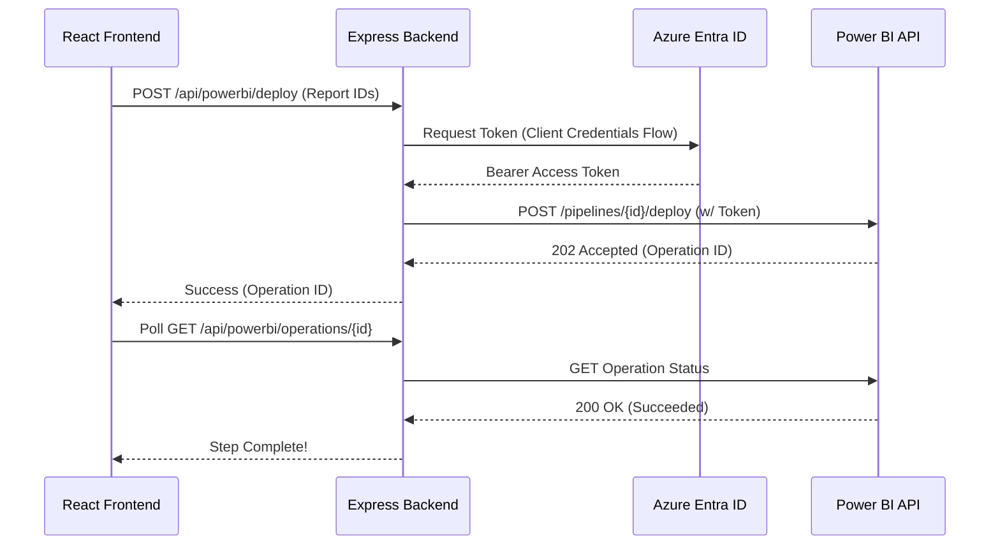

# Power BI Deployment Orchestrator

A comprehensive full-stack web application designed to orchestrate and automate Microsoft Power BI deployment pipelines. Built with React (frontend) and Express (backend), this application securely manages Azure Entra ID Service Principal credentials to automate report deployments, dataset ownership takeovers, parameter updates, and semantic model refreshes.

## 🚀 Features

* **Multi-Pipeline Support:** Seamlessly switch between multiple Power BI deployment pipelines via a dropdown selector.
* **Pipeline Discovery:** Automatically fetches workspace bindings, stages, and artifact lists (reports, datasets) for the selected pipeline.
* **Selective Artifact Deployment:** Allows users to select specific reports and datasets to promote from a source stage (e.g., Test) to a target stage (e.g., Production).
* **Automated Dataset Takeover:** Automatically takes ownership of deployed datasets in the target workspace, a necessary step before updating parameters or triggering refreshes via a Service Principal.
* **Dynamic Parameter Management:** Inspects dataset parameters post-deployment and allows you to dynamically update them (e.g., changing a database connection from a test server to a production server).
* **Automated Semantic Model Refresh:** Triggers and polls cloud-side dataset refreshes to ensure data is populated and up-to-date after a deployment and parameter update.
* **Activity Logging:** Built-in real-time transaction logger to inspect request payloads, response codes, durations, and network telemetry.
* **Auto-Advance Execution:** Optional auto-advance toggle to run the entire deployment sequence automatically, pausing only if user input or validation is required.
* **Secure Backend Proxy:** Eliminates client-side credential exposure. All OAuth token acquisition and Power BI REST API communications occur strictly on the backend Node.js server.

## 🎨 Complete Design and Behavior

### User Interface Design
The application features a modern, dark-themed user interface built with **Tailwind CSS**. It is designed to look like a professional, enterprise-grade developer tool:
* **The Canvas:** A deep neutral background (`neutral-950`) with high-contrast text (`neutral-200`) and amber accent colors for active states and highlights.
* **The Stepper:** A top-level progress tracker divided into 7 distinct grid columns, visually guiding the user through the strict sequential execution of the deployment pipeline.
* **Tabbed Navigation:** A clean header allows users to toggle between the primary "Pipeline" execution view and a real-time "Activity Logs" view.

### System Behavior & Workflow
The application enforces a strict, step-by-step sequential workflow to guarantee deployment safety. The frontend communicates exclusively with the local backend proxy, which handles all authentication and external API requests.

The 7-step orchestration workflow behaves as follows:
1. **Workspace & Pipeline Info:** Discovers the source and target stages, identifying the bound Power BI workspaces.
2. **List Stage Reports:** Enumerates all available reports and datasets in the source stage. Users check the boxes for the artifacts they wish to deploy.
3. **Check Stage Parameters:** (Optional) Reviews pre-deployment parameters of the selected datasets.
4. **Deploy to Production:** Triggers the pipeline deployment via the backend proxy and verifies a `200 OK` status from the Power BI API.
5. **Take Over Datasets:** The system identifies the new IDs of the deployed datasets in the target workspace and issues a takeover command so the Service Principal assumes ownership.
6. **Check & Update Prod Parameters:** Fetches the parameters of the newly deployed target datasets, allowing the user to update connection strings or environment variables.
7. **Trigger & Verify Refresh:** Initiates a semantic model refresh on the target datasets and polls the backend until the refresh completes successfully.

### Architecture


### Sequence Flow (Example: Triggering a Deployment)


## 📋 Prerequisites & Setup

1. **Azure Entra ID App Registration (Service Principal):**
   * Create an App Registration in your Azure Portal.
   * Generate a Client Secret.
   * Add Power BI Service API permissions (e.g., `Pipeline.ReadWrite.All`, `Dataset.ReadWrite.All`, `Workspace.ReadWrite.All`).
   * Grant Admin Consent for these permissions in your tenant.
2. **Power BI Admin Settings:** Ensure "Allow service principals to use Power BI APIs" is enabled in the Power BI Admin Portal.
3. **Workspace Access:** Add the Service Principal as an "Admin" or "Member" to the workspaces bound to your deployment pipeline.

### Installation

1. **Install Dependencies:**
   ```bash
   npm install
   ```

2. **Configure Environment Variables:**
   Create a `.env` file in the root directory:
   ```env
   AZURE_TENANT_ID="your_tenant_id_here"
   AZURE_CLIENT_ID="your_client_id_here"
   AZURE_CLIENT_SECRET="your_client_secret_here"
   POWERBI_PIPELINE_IDS="pipeline_1_id,pipeline_2_id"
   ```

3. **Start the Development Server:**
   ```bash
   npm run dev
   ```

4. **Production Build:**
   ```bash
   npm run build
   npm start
   ```

---

## 📝 Changelog (Recent Updates)

Here is a complete list of the updates, fixes, and features added to the application today:

### [New Feature]
* **Dedicated Dataset Takeover Step:** Added a brand-new UI step (Step 5) to specifically handle Dataset Takeover. This UI lists exactly which newly deployed datasets require ownership transfer and provides a dedicated execution button for better visibility and control.

### [Change]
* **7-Step Workflow Architecture:** Re-architected the `App.tsx` state machine to expand the pipeline from 6 steps to 7 distinct steps to accommodate the dedicated Takeover component.
* **Separation of Concerns:** Extracted the dataset takeover logic out of the Deployment step (formerly Step 4) and moved it into its own dedicated function (`executeStep5`).
* **UI Component Shifting:** Shifted the existing "Update Parameters" component from Step 5 to Step 6, and the "Semantic Refresh" component from Step 6 to Step 7.

### [Fix]
* **Stepper Grid Layout Bug:** Fixed a visual layout bug in the `Stepper.tsx` component where it was hardcoded to a 6-column grid (`grid-cols-6`), causing the new 7th step to wrap to a new line. Updated the container to `grid-cols-7`.
* **Step Numbering Circles:** Corrected the hardcoded visual step indicators in the UI headers for the "Parameters" and "Refresh" components (updated from 5 to 6, and 6 to 7 respectively).
* **JSX Syntax Error:** Removed a stray `\n` character that was accidentally injected into the React code during file patching, which was breaking the Vite build process.
* **TypeScript Linting Errors:** Fixed a TypeScript error where the `title` attribute was improperly passed directly to a `lucide-react` SVG icon component (`<AlertCircle />`). Wrapped the icons in a standard HTML `<span>` tag with the title attribute to satisfy the type checker and restore the build to a green state.
